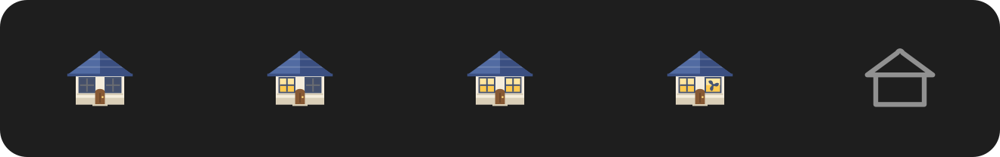

# Homestead

<p align="center"></p>

<p align="center">Part of the <a href="https://widgets.nicksmith.software">Menubarn</a> widget library.</p>

Home Assistant in the menu bar. The first row picks a dashboard; the rest of the
menu is that dashboard's devices — switches you can flip, sliders for
brightness, warmth, fan speed, blind position and target temperature, a colour
picker for bulbs that have one, and transport controls for media players.
Nothing closes the menu, so you can turn three things on without opening it
three times.

<p align="center"></p>

The glyph carries the state: windows light with the number of lights on in the
selected dashboard, a fan turns in the right window while any fan is running,
and the house goes hollow when Home Assistant cannot be reached — which is
normal on a laptop that sometimes sits behind a VPN.

## Install

```bash
./install.sh
```

That builds `Homestead.app` and symlinks it into `~/Applications`, then opens
it. First run:

1. In Home Assistant: your profile ▸ Security ▸ **Long-lived access tokens** ▸
   Create token. Copy it.
2. Homestead ▸ **Connection…**, enter the server URL
   (`http://homeassistant.local:8123`), paste the token, press **Test**, then
   **Save**.
3. Optional: **Dashboards…** to choose which of your dashboards the picker
   offers and drag them into the order you want. **Start at Login** is in the
   same menu.

The token is stored in your login Keychain.

**On the address you give it:** `http://` means the WebSocket runs unencrypted,
and the token is the first frame sent on it — so anyone on the network path can
read it. That is fine over your own LAN or a Tailscale/WireGuard tunnel, which
is what most people point this at. Over the open internet, use `https://` (Nabu
Casa or your own reverse proxy); the app follows the scheme you give it and
never silently upgrades or downgrades.

## What appears in the menu

Homestead reads the dashboard's own configuration, so what you get is whatever
that dashboard shows — it does not invent a layout of its own. Cards are walked
structurally rather than by type, so stacks, grids, sections, conditionals and
custom cards all work.

| Entity | Row shows | Controls |
|---|---|---|
| `light` | brightness % | switch, brightness slider, warmth slider in kelvin (tunable white), colour swatch opening the system picker (colour bulbs, once one is on and reporting a colour) |
| `switch`, `input_boolean`, `remote` | — | switch |
| `fan` | speed % | switch, speed slider snapped to the fan's own step |
| `cover` | Open/Closed/Opening, position | open/close, position slider where supported |
| `climate`, `water_heater` | reading → target | switch, temperature slider over the entity's own band |
| `media_player` | what's playing, or the source | power, volume, ⏮ ⏯ ⏭ — each only if the player reports it |
| `sensor`, `binary_sensor` | value and unit | read-only, and hidden unless **Show Sensors** is ticked |

Anything else — automations, scenes, scripts — is skipped rather than shown as
a row that cannot do anything.

## Why not a SwiftBar plugin?

Several of these widgets began as SwiftBar plugins. This one could not be:

- **State arrives, it is not polled.** Homestead holds one WebSocket to Home
  Assistant and subscribes to exactly the entities on the selected dashboard.
  Change a light from your phone and the row moves while the menu is open. A
  plugin is a script re-run on a timer; it would have to poll the REST API and
  would still be wrong between ticks.
- **Real controls.** Switches, sliders and transport buttons live in the menu as
  views, so using one does not dismiss the menu. A plugin's dropdown is whatever
  its text protocol can express.
- **The token is not in a shell script.** It lives in the Keychain, written by
  the app.
- **Testable.** The protocol, the dashboard parser, the state diffing and every
  service call are a library with unit tests, not a script whose only test is
  opening the menu.

## Development

```bash
swift test              # the whole HomesteadCore suite
./scripts/build-app.sh  # build build/Homestead.app
./art/render-art.sh     # redraw the glyph strip, and sync the mascot across
python3 art/gen_app_icon.py   # regenerate the app icon (Gemini) and rebuild the .icns
```

The app icon is generated with Gemini (`gemini-2.5-flash-image`) and then cut to
shape here: the model paints the cottage, `art/gen_app_icon.py` masks it into
macOS's superellipse tile at Apple's clear-space ratio and builds the `.icns`,
because that half is geometry rather than taste. The mascot comes from the same
pipeline the rest of the Menubarn cast uses
(`widgets.nicksmith.software/art/gen_icons.py homestead`). The menu-bar glyph is
drawn in code and always will be: it changes with live state, which a generated
raster cannot. It is drawn for a Retina bar — half-point sills, mullions and
shingle courses land on half pixels at 2x — and anyone on a non-Retina display
can pick the plain Dot in **Icon ▸**.

`HomesteadCore` holds everything that can be tested without a screen — the
WebSocket protocol, the dashboard parser, the state store, unit conversions and
service calls. The `Homestead` target is AppKit only, built on the shared
[StatusItemKit](https://github.com/nicholaspsmith/StatusItemKit).

### The Keychain prompt, and the escape hatch

macOS pins a Keychain item to the code signature of the binaries that have
touched it. With a self-signed certificate that pin is the binary's cdhash,
which changes on every build — so while developing, each rebuild asks for your
login password before the app can read its own token, and "Always Allow" only
whitelists the build that just asked. (There is no way around it on a
self-signed app: the data-protection Keychain, which has no ACLs at all,
requires an entitlement self-signed code cannot carry, and a stable partition
needs a real Developer ID team.)

If you are rebuilding constantly, move the token to a file instead:

```bash
defaults write com.nicholaspsmith.Homestead UseFileTokenStore -bool true
```

It is then kept at `~/Library/Application Support/Homestead/ha-token`, mode
`0600`, and migrated out of the Keychain on the next launch. **This is weaker**
— a file is readable by anything running as you, goes into backups as plaintext,
and is not encrypted at rest — so it is off by default and deliberately absent
from the UI. An installed build is never rebuilt and never sees the prompt.

Set it back to `false` and re-save the token in **Connection…** to return to the
Keychain.

## Design notes

`docs/superpowers/specs/` holds the design this was built from and
`docs/superpowers/plans/` the implementation plan. A few decisions worth
knowing:

- **The dashboard picker expands inside the menu.** An `NSPopUpButton` cannot be
  clicked at all while a menu is tracking — the menu owns the mouse — and a
  submenu would dismiss the whole menu on selection. View-based rows do neither.
- **Sliders appear only while a device is on**, except a thermostat's: a set
  point matters whether or not it is currently heating, and is usually what you
  want to change before turning it on.
- **Colour and warmth are separate controls.** Neither can express the other: a
  colour wheel cannot pick a precise white, and `color_temp` is not a colour.
- **Drags are coalesced.** One service call per entity is in flight at a time
  with the newest value queued behind it, so dragging a slider cannot queue
  fifty stale commands at a bulb.
- **The log does not name your house.** Dashboard titles and entity ids are
  logged `.private`, so counts show up in `log show` but the names of your rooms
  and devices do not end up in a sysdiagnose. Counts stay public, which is
  enough to see what the app is doing.
- **The token file is created `0600`, not written and then chmod-ed.** An atomic
  write lands a temporary file at the default `0644` and renames it, which
  leaves a window where any other account on the machine can read it.

The spec in `docs/superpowers/specs/` is the design this was built from, not a
description of what it became. Media players, remotes, colour, colour
temperature, the dashboard chooser and its ordering all arrived afterwards;
scenes, scripts and an Areas fallback for auto-generated dashboards still have
not.

## Licence

MIT. See [LICENSE](LICENSE).
