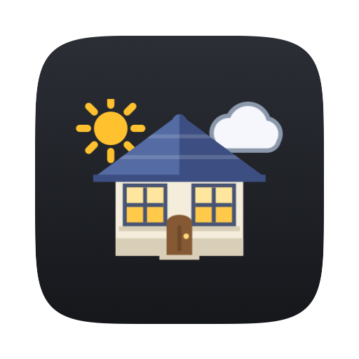
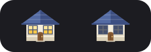
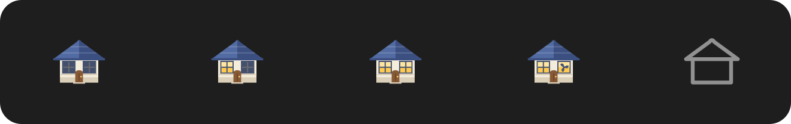

# Homestead

<p align="center"></p>

<p align="center">Part of <strong><a href="https://menumon.nicksmith.software">Menumon</a></strong>.</p>

<p align="center"></p>

**Version 1.4.0** · [Changelog](https://github.com/nicholaspsmith/home-assistant-menubar/releases)

Home Assistant in the menu bar. The first row picks a dashboard; the rest of the
menu is that dashboard's devices: switches, sliders for brightness, warmth, fan
speed, blind position and target temperature, a colour picker for colour bulbs,
and transport controls for media players. Using a control does not close the
menu.

<p align="center"></p>

## The menu-bar icon

The icon is a cottage:

- **Windows light** with the number of lights on in the selected dashboard.
- **A fan turns** in the right window while any fan is running.
- **The house is hollow** when Home Assistant cannot be reached (expected while
  a VPN blocks the route to it).
- **Weather** from a Home Assistant `weather` entity is drawn around the house:
  sun or moon behind the roof (`sun.sun` decides night), clouds over it, rain,
  snow, sleet or lightning beside the walls, fog and wind. Hover the icon for
  the conditions and temperature.

Now and then Gertie welcomes you: the front door swings open a crack and
shuts again (1.2 s), lamplight showing in the gap when a light is on. Only a
house that is answering does it. When several Menumon mascots are running they
take turns, a second apart: Archimedes (Claude Usage), Menu Pimp (Mac Daddy),
Carol (SoundChain), Iguanamous (VPN & DNS), Armonitor (Monitor Lizard), Volta
(Battery Time), Apollo (Apollo Monitor), Lumen (KeyLight), Manny (MacRecorder),
then Gertie, counting only the ones that are running. Skipped when Reduce
Motion is on.

**Icon ▸ Dot** replaces the cottage with a plain dot; **Icon ▸ House** restores it.

## Requirements

- macOS 13+
- Xcode Command Line Tools (Swift 5.9+)
- [StatusItemKit](https://github.com/nicholaspsmith/StatusItemKit) cloned
  beside this repo (`../StatusItemKit`; `Package.swift` uses it by path)
- A Home Assistant server reachable over HTTP(S)

## Install

```bash
./install.sh
```

This builds `Homestead.app`, symlinks it into `~/Applications`, asks whether to
turn on Start at Login, arms the release `pre-push` hook, then (re)launches the
app.

## First run

1. Choose **Connect to Home Assistant…** (the only way in while signed out;
   once signed in it is **Connection…**, near the bottom of the menu). A server
   that announces itself over Bonjour (`_home-assistant._tcp`) is filled in;
   otherwise enter its address, e.g. `http://homeassistant.local:8123`.
2. **Sign In with Browser** opens Home Assistant's login page. Log in; the tab
   says "Signed in" and Homestead connects. The sign-in waits five minutes, even
   if you close the Connection window. **Reopen Login Page** shows the same page
   again; a tab from an earlier attempt is rejected without cancelling the
   current one.
3. Optional: **Dashboards…** chooses which dashboards the picker offers and in
   what order (drag to reorder).

### Sign-in and tokens

Sign-in returns a 30-minute access token and a refresh token; Homestead uses
the refresh token to get a new access token on each reconnect. Both are stored
in the login Keychain. **Sign Out** (in **Connection…**) deletes them and
revokes the refresh token on the server; you can also revoke it in Home
Assistant under your profile ▸ Security ▸ Refresh tokens. A long-lived token
stored by an older version keeps working until you sign in again.

The login page redirects to `http://127.0.0.1:47815/auth/callback`, a
loopback-only listener that is open only while a sign-in is waiting, so Home
Assistant's login page names the app "127.0.0.1".

**Use `https://` across untrusted networks.** With `http://` the WebSocket is
unencrypted and the access token is its first frame. That is fine on your LAN
or over a Tailscale/WireGuard tunnel; over the internet use `https://` (Nabu
Casa or a reverse proxy). Homestead uses the scheme you give it and never
upgrades or downgrades it.

## The menu

Homestead renders the selected dashboard's own configuration rather than a
layout of its own. Cards are walked structurally, not by type, so stacks,
grids, sections, conditionals and custom cards all work. Heading cards title
the rows that follow them.

A card whose tap calls a service (`tap_action: perform-action`, or the older
`call-service`) becomes a **button**, not a row for the entity it names: fifteen
tiles on one `remote` entity, each sending a different command, are fifteen
buttons. Buttons from the same grid card keep its columns, so a D-pad stays a
D-pad. Arrows, transport, volume and power show as glyphs, anything else by
name. A card with `confirmation` asks inline: the first press shows
**Confirm?**, the second acts. A tap that only toggles the card's own entity is
that entity's normal row.

| Entity | Row shows | Controls |
|---|---|---|
| `light` | brightness % | switch, brightness slider, warmth slider in kelvin (tunable white), colour swatch opening the system picker (colour bulbs, once on and reporting a colour) |
| `switch`, `input_boolean`, `remote`, `automation`, `group` | — | switch |
| `button`, `input_button`, `script`, `scene` | — | Press / Run / Activate |
| `fan` | speed % | switch, speed slider snapped to the fan's own step |
| `cover` | Open/Closed/Opening, position | open / stop / close, position slider where supported (shown even while closed) |
| `climate`, `water_heater` | reading · current action (Heating, Cooling, Idle) | mode picker from the entity's `hvac_modes` (in place of the switch); the target, or both ends of a heat/cool range, as buttons: click one, then ▲▼ step it |
| `media_player` | what's playing, or the source | power, volume slider or volume ▼ mute ▲, ⏮ ⏯ ⏭ — each only if the player supports it |
| `sensor`, `binary_sensor` | value worded as HA does (OK/Problem, 6 h ago, 14 d) | read-only; hidden unless **Show Sensors** is ticked |

Anything else (to-do lists, cameras, weather cards) is skipped.

### Settings items

| Item | Does |
|---|---|
| **Show Sensors** | Shows `sensor` and `binary_sensor` rows |
| **Start at Login** | Registers the app with `SMAppService` |
| **Icon ▸** | House or Dot |
| **Weather ▸** | Weather entity for the icon: Automatic (prefers `weather.forecast_home`), a specific entity, or None. Absent when HA has no weather entity |
| **Dashboards…** | Which dashboards the picker offers, and their order |
| **Connection…** | Server address, sign in / sign out (shown when signed in) |

## Development

```bash
swift test                    # the HomesteadCore test suite
./scripts/build-app.sh        # build build/Homestead.app
./art/render-art.sh           # redraw docs/menubar-icon.png; copy the mascot from the site repo
python3 art/gen_app_icon.py   # regenerate the app icon (Gemini) and rebuild the .icns
```

- `HomesteadCore` holds everything testable without a screen: the WebSocket
  protocol, auth, the dashboard parser, the state store, unit conversions and
  service calls.
- `Homestead` is the AppKit app, built on
  [StatusItemKit](https://github.com/nicholaspsmith/StatusItemKit).
- The menu-bar glyph is drawn in code (`CharacterIcon` in StatusItemKit, used
  by `HouseIcon.swift`) because it changes with live state.
  `art/render-art.sh` renders the README strip from that same code.
- The app icon comes from `art/gen_app_icon.py`: Gemini
  (`gemini-2.5-flash-image`) paints it, and the script masks it to the macOS
  tile shape and builds `Resources/bundle/AppIcon.icns`. The mascot comes from
  the Menumon site's pipeline
  (`widgets.nicksmith.software/art/gen_icons.py homestead`).
- Logs use subsystem `com.nicholaspsmith.Homestead`. Dashboard titles and
  entity ids are logged `.private`; counts are public.

### The Keychain prompt, and the file token store

macOS pins a Keychain item to the code signature of the binaries that touched
it. With a self-signed certificate that is the binary's cdhash, which changes
on every build, so each rebuild asks for your login password before the app
can read its token ("Always Allow" covers only that build). A self-signed app
has no way around this.

If you rebuild often, store the token in a file instead:

```bash
defaults write com.nicholaspsmith.Homestead UseFileTokenStore -bool true
```

The token then lives at `~/Library/Application Support/Homestead/ha-token`
(mode `0600`) and is moved out of the Keychain on the next launch. **This is
weaker**: the file is readable by anything running as you and is backed up as
plaintext, so the setting is off by default and not in the UI. To return to the
Keychain, set it to `false` and sign in again in **Connection…**.

### Implementation notes

- **The dashboard picker expands inside the menu.** An `NSPopUpButton` cannot be
  clicked while a menu is tracking, and a submenu would dismiss the menu on
  selection. View-based rows do neither.
- **Sliders show only while a device is on**, except a cover's: setting a
  closed shade to half-way is how you open it half-way.
- **Thermostat targets are stepped with buttons.** Presses collect briefly and
  go as one service call, and the row shows the sent value until the
  thermostat confirms it. Keyboard arrows cannot be used: a tracking menu keeps
  key events to itself.
- **Drags are coalesced.** One service call per entity is in flight at a time,
  with only the newest value queued behind it.
- **The token file is created `0600` in one step**, not written and then
  chmod-ed, so it is never briefly readable by other accounts.

The original design and plan are in `docs/superpowers/specs/` and
`docs/superpowers/plans/`; the shipped app has outgrown them.

## Releasing

Every push to `main` is a release. Before pushing, add a dated
`## [X.Y.Z] - YYYY-MM-DD` section to the top of [`CHANGELOG.md`](CHANGELOG.md)
(minor for features, patch for fixes; turn a waiting `## [Unreleased]` into
it). When it reaches `main`, GitHub tags `vX.Y.Z` and publishes the section as
a release titled `vX.Y.Z`. Without a new version:

- the `pre-push` hook refuses the push;
- a pull request **cannot merge** — `release / check` is required on `main`;
- a push that reaches `main` anyway fails the release workflow.

The one exception is `[no release]` in the tip commit's message, for changes
nothing a user runs (setup, CI, developer docs): it passes every check with no
version bump and no tag. Never tag or create a release by hand, and never
`gh pr merge --admin` past a failing check — fix the PR. After merging,
`git pull` for the tag and rebuild. `install.sh` re-arms the hook on a fresh
clone. See [StatusItemKit — Releases](https://github.com/nicholaspsmith/StatusItemKit#releases-every-push-is-one)
for the full rule.

## License

Copyright (c) 2026 Nicholas Smith. Licensed under the
[Mozilla Public License 2.0](LICENSE). You may use, modify, sell and
redistribute this software, including inside proprietary products, provided
the copyright notice and license stay on these files and any modified
versions of them are made available under the same license.

